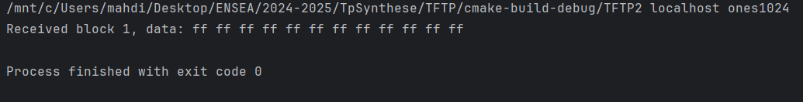
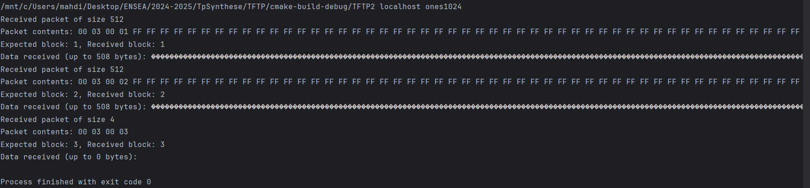
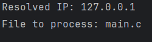
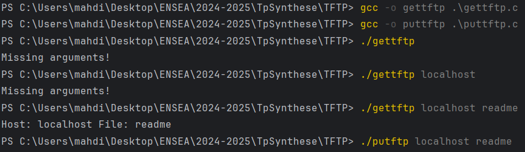
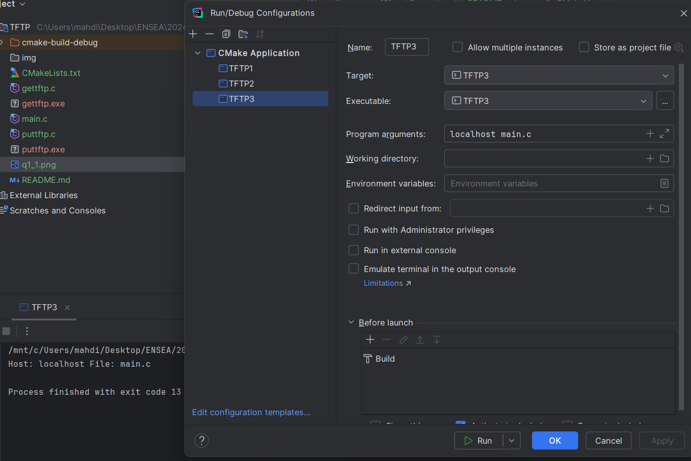

# TFTP TP2 By ELLOUMI Molka and HADJ SASSI Mahdi

### 4. For gettftp:
Difficulties: Wireshark is not functional in our case, maybe because
we're using WSL as our environment and we're running the wireshark on
windows, so it can't detect the same channel.

Then to surpass this limit we've run on a WSL terminal this command to see
the different requests passed !
``tcpdump -i lo -v --print``

After running our TFTP Server, and we passed as arguments: localhost and
ones1024 we got this response :
```
root@MahdiHadjSassi:~# tcpdump -i lo -v --print
tcpdump: listening on lo, link-type EN10MB (Ethernet), snapshot length 262144 bytes
16:50:39.083823 IP (tos 0x0, ttl 64, id 43200, offset 0, flags [DF], proto UDP (17), length 45)
localhost.35030 > localhost.1069: UDP, length 17
16:50:39.088948 IP (tos 0x0, ttl 64, id 43201, offset 0, flags [none], proto UDP (17), length 544)
localhost.39411 > localhost.35030: UDP, length 516
16:50:39.089642 IP (tos 0x0, ttl 64, id 43202, offset 0, flags [DF], proto UDP (17), length 32)
localhost.35030 > localhost.39411: UDP, length 4
16:50:39.089757 IP (tos 0x0, ttl 64, id 43203, offset 0, flags [none], proto UDP (17), length 544)
localhost.39411 > localhost.35030: UDP, length 516
16:50:39.090369 IP (tos 0x0, ttl 64, id 43204, offset 0, flags [DF], proto UDP (17), length 32)
localhost.35030 > localhost.39411: UDP, length 4
16:50:39.090434 IP (tos 0x0, ttl 64, id 43205, offset 0, flags [none], proto UDP (17), length 32)
localhost.39411 > localhost.35030: UDP, length 4
16:50:39.090487 IP (tos 0x0, ttl 64, id 43206, offset 0, flags [DF], proto UDP (17), length 32)
localhost.35030 > localhost.39411: UDP, length 4
```

#### b) Receive a file consisting of a single Data (DAT) packet and its acknowledgment (ACK).
since we're requesting ones1024 so we got this response : 


#### c) Receive a file consisting of multiple Data (DAT) packets and their respective acknowledgments (ACK).
Since we're requesting ones1024 so we got this response :




### 3. Reserve a connection socket to the server.
We've defined a socket initialization in the utils.c and we've called in the ``puttftp.c`` and ``getftp.c``


### 2. Call getaddrinfo to obtain the server’s address.
To follow the clean code we've split our code into multiple functions
and we have shown the IPv4 address in both gettftp and puttftp.
Since we're using the localhost as our host then the IPv4 address is ```127.0.0.1```




### 1. Use command-line arguments for the gettftp and puttftp programs to obtain request information (server and file).

We tested the both codes, with the command line, by passing the arguments and then
we'll work on the edit configuration to make it easier!

Using Command line! 


Now using the edit configuration! 


